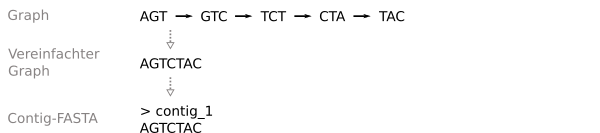
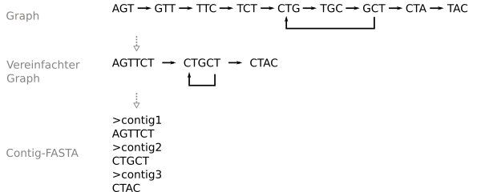
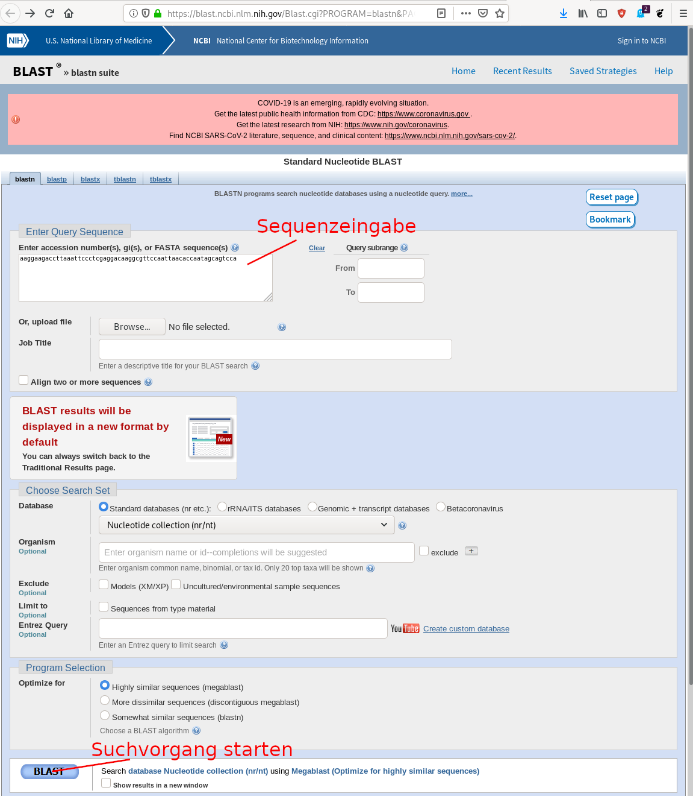
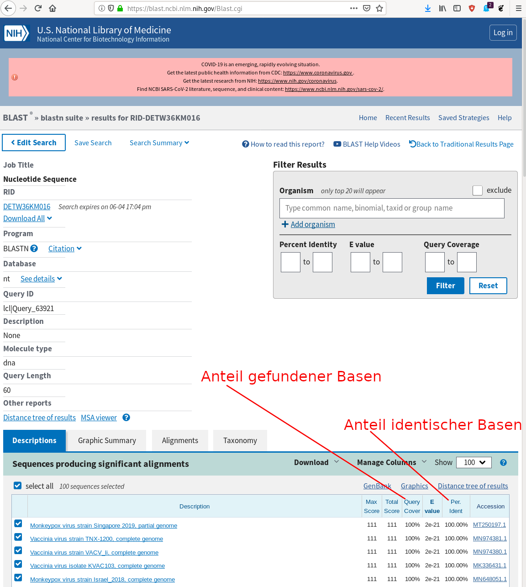
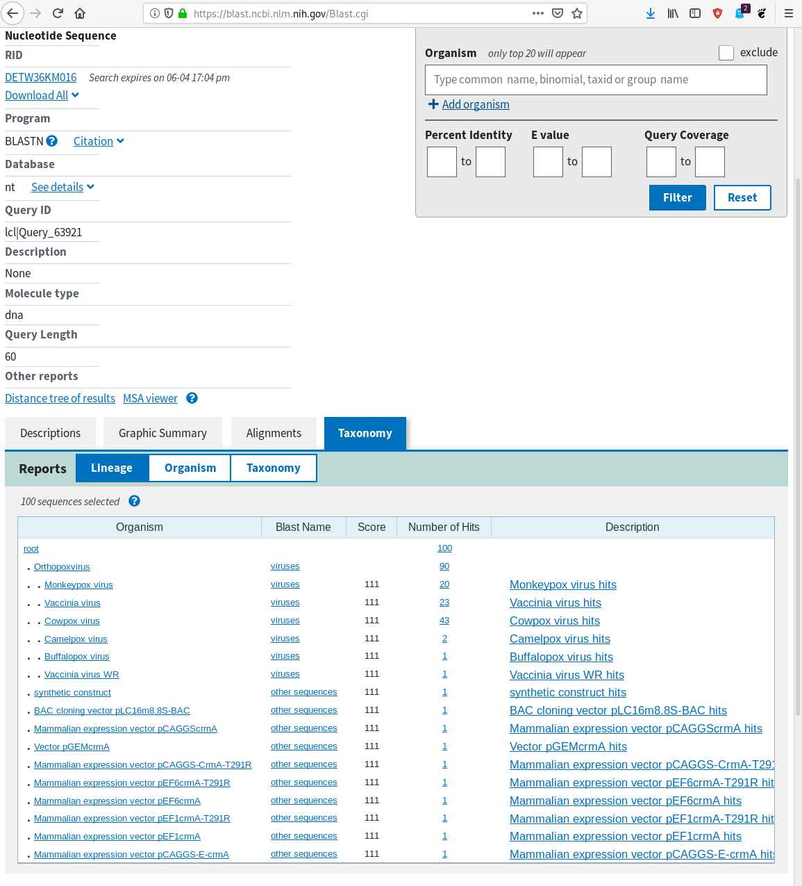
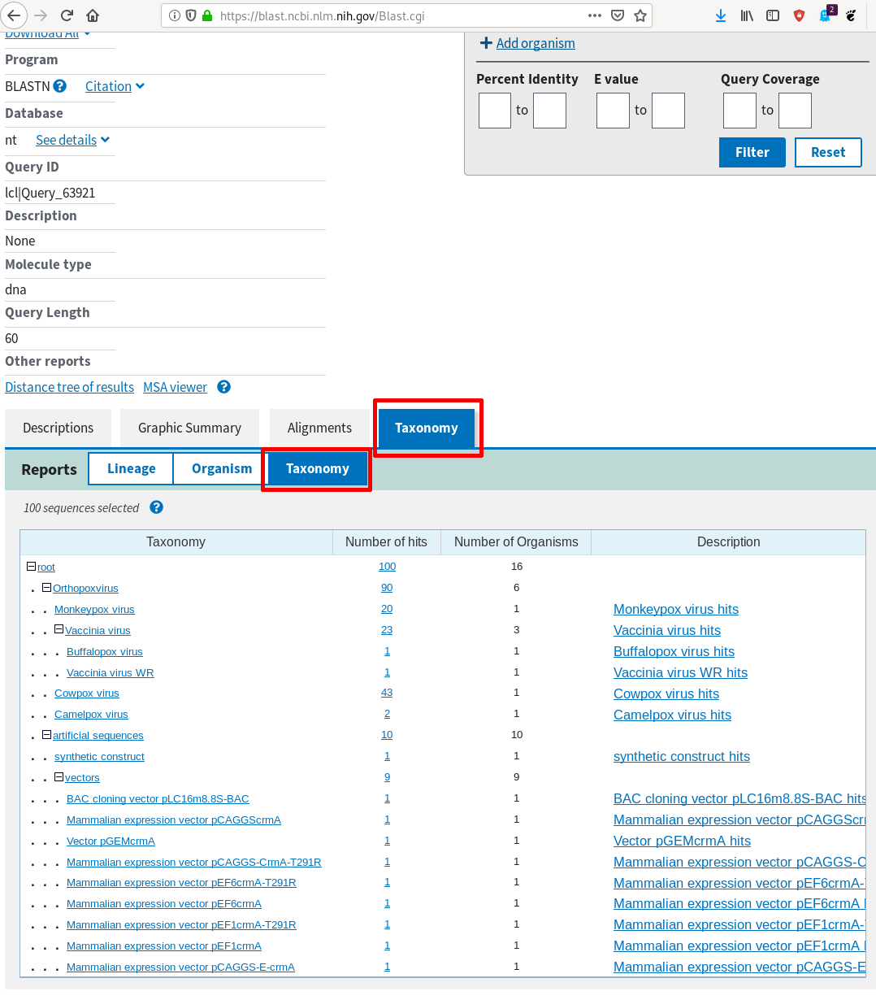

# De Novo Assembler - Teil 2

Nachdem Sie einen grundlegenden DBG aufgebaut haben, können Sie daraus nun das Genom rekonstruieren. Zunächst muss (bzw. sollte, da sonst alle späteren Operationen extrem aufwändig werden) dazu allerdings der Graph vereinfacht werden: Hintereinander liegende Knoten können verschmolzen werden, wenn sie eindeutig eine Sequenz beschreiben. Nach dieser Vereinfachung ist der Graph kein DBG mehr - die Knoten können unterschiedlich lange Sequenzen repräsentieren. Dafür repräsentiert aber jeder Knoten eine Teilsequenz des Genoms, die sicher rekonstruiert wurde.

## Konzept des Verschmelzens von Knoten

Überprüfen Sie zum Verschmelzen für jeden Knoten, ob er mit seinem Vorgänger oder Nachfolger verschmolzen werden kann. Dabei gelten folgende Kriterien:

* Wenn ein Knoten selber mehr als einen Nachfolger (mehr als eine ausgehende Kante) hat, kann er mit keinem Nachfolger verschmolzen werden (es ist nämlich nicht eindeutig, mit welchem)
* Wenn der Vorgänger A eines Knotens B mehr als einen Nachfolger hat, kann der Knoten B nicht mit seinem Vorgänger verschmolzen werden (sonst wäre nicht klar, was mit der ausgehenden Kante von dem Vorgängerknoten nach dem Verschmelzen passieren soll)
* Wenn ein Knoten selber mehr als einen Vorgänger (mehr als eine eingehende Kante) hat, kann er mit keinem Vorgänger verschmolzen werden (es ist nämlich wieder nicht eindeutig, mit welchem)
* Nach Verschmelzung zweier Knoten A und B zu einem neuen Knoten C, wobei A der Vorgänger und B der Nachfolger waren:
  * Sind die eingehenden Kanten von C alle Kanten, die eingehende Kanten von A waren, und die ausgehenden Kanten von C alle Kanten, die ausgehende Kanten von B waren
  * Ist die Sequenz von C die Sequenz von A erweitert um die letzte Base von B

Verschmelzen Sie Knoten in dem Graph so lange, bis keine Knoten mehr verschmolzen werden können (es bietet sich dafür z.B. die Verwendung eines neuen Graphen an: Sie können irgendeinen Knoten aus dem DBG nehmen, ihn so lange nach vorne und hinten verschmelzen, wie möglich, und ihn dann aus dem DBG rausnehmen und in einen neuen Graph/ein neues Set von Knoten packen - das machen Sie so lange, wie noch Knoten im DBG sind; das ist aber nur eine Möglichkeit, wählen Sie eine Herangehensweise, die Ihnen gefällt).

Geben Sie, nachdem Sie mit der Vereinfachung des Graphen fertig sind, die Sequenzen aller verschmolzenen Knoten in einer FASTA-Datei als Contigs aus.

Ein einfaches Beispiel ist dieser sehr einfache, lineare Graph, der nach Vereinfachung nur einen Knoten und somit in der FASTA-Datei nur einen Contig ergibt:



Das ist auch das, was bei test.fasta mit einer k-mer-Länge von 3 passieren wird.

Ein komplexeres Beispiel ist dieses hier:



Nach Vereinfachung kriegen Sie 3 Knoten, die jeweils als ein Contig ausgegeben werden müssen. Grund ist, dass das Genom nicht eindeutig rekonstruiert werden kann: Sie können nicht klar sagen, wie häufig der Knoten "CTGCT" vorkommt, das Genom könnte genausogut "AGTTCTGCTCTAC" wie auch "AGTTCTGCTGCTAC" oder "AGTTCTGCTGCTGCTGCTGCTGCTGCTGCTGCTAC" lauten.

Hier wird die Bedeutung der k-mer-Länge klar: Wird beim Assembly eine zu geringe k-mer-Länge gewählt, können Sie repetitive Sequenzen nicht klar auflösen und müssen anstatt eines langen Genoms mehrere kurze Contigs ausgeben. Wird eine zu hohe k-mer-Länge gewählt, zerfällt der Graph unter Umständen bereits bei der Erstellung des DBG in mehrere nicht miteinander verbundene Teilgraphen, da zwischen den Reads keine Überlappungen vorhanden sind, die so lang sind, wie die verlangte k-mer-Länge (und Sie müssen wieder mehrere Contigs ausgeben, weil Sie die Knoten nicht miteinander verbunden kriegen).

## Implementation

Implementieren Sie dafür in der Klasse ```DBGNode``` die folgenden zusätzlichen Methoden:

* ```can_extend_next(self)```: Überprüft nach den o. g. Kriterien, ob der Knoten nach rechts (Richtung next-Kante) erweitert werden kann und gibt entsprechend ```true``` oder ```false``` zurück. 
* ```can_extend_prev(self)```: Überprüft nach den o. g. Kriterien, ob der Knoten nach links (Richtung prev-Kante) erweitert werden kann und gibt entsprechend ```true``` oder ```false``` zurück.
* ```extend_next(self)```: Erweitert den Knoten falls möglich nach den o. g. Kriterien nach rechts (also: fügt hinten an die Sequenz des Knotens die letzte Base des rechts liegenden Knotens hinzu, übernimmt die Kanten des rechts liegenden Knotens). Gibt den Knoten rechts, um den erweitert wurde, zurück (dadurch wird das Rauslöschen in simplify in ```DBGraph``` einfacher).
* ```extend_prev(self)```: Erweitert den Knoten falls möglich nach den o. g. Kriterien nach links (also: fügt vorne an die Sequenz des Knotens die erste Base des links liegenden Knotens an, übernimmt die Kanten des links liegenden Knotens). Gibt den Knoten links, um den erweitert wurde, zurück (dadurch wird das Rauslöschen in simplify in ```DBGraph``` einfacher).

Implementieren Sie dann in der Klasse ```DBGraph``` die folgenden zusätzlichen Methoden:

* ```simplify(self)```: Vereinfacht den DBG. Vorsicht: Nach einer Vereinfachung sollte ein Hinzufügen von k-meren nicht mehr möglich sein, es gibt ja keine klar definierte Dimension des Graphen mehr (es ist kein DBG mehr, jeder Knoten kann eine andere Länge haben).
* ```get_FASTA(self)```: Gibt die Sequenzen aller Knoten als FASTA-Datei aus

## Zuordnen der Sequenzen mittels BLAST

Die Sequenz an sich ist aber nur die halbe Miete - nun stellt sich die Frage, was Sie da eigentlich gerade für einen Organismus (potentiell Erreger?) vor sich haben. Dafür kann die assemblierte Genomsequenz (oder auch einer der Contigs) mit einer Datenbank von bekannten Sequenzen abgeglichen werden. Ein populäres Tool dafür ist BLAST (Basic Local Alignment Search Tool) in Kombination mit den Sequenzdatenbanken des NCBI (National Centre for Biotechnology Information). Zugang zu dem Tool finden Sie hier:

https://blast.ncbi.nlm.nih.gov/Blast.cgi

Wenn Sie auf "Nucleotide BLAST" klicken (https://blast.ncbi.nlm.nih.gov/Blast.cgi?PROGRAM=blastn&PAGE_TYPE=BlastSearch&LINK_LOC=blasthome) gelangen Sie zu einer Seite, auf der Sie oben rechts unter "Enter Query Sequence" eine Sequenz eingeben können (die anderen Parameter sind in ihren Standardeinstellungen so in Ordnung). Dann können Sie die Suchabfrage mit dem BLAST-Button unten links starten:



Sie kommen auf eine Status-Seite, auf der Sie den aktuellen Status der Suchabfrage angezeigt bekommen. Wenn die Suche abgeschlossen ist (meist in unter 30 Sekunden) bekommen Sie eine Ergebnisseite angezeigt (in diesem Beispiel das Ergebnis nach Eingabe der Suchsequenz "atctcgtcagtattgacaatactgtattatggagctaatggatccactgctgaacagcta"):



Unten finden Sie eine Auflistung der Sequenzen aus der Datenbank, die Ähnlichkeit zu der von Ihnen eingegebenen Sequenz besitzen. Von besonderer Relevanz sind die Query Coverage (Anteil der Basen aus der von Ihnen eingegebenen Sequenz, die Basen aus der jeweiligen Datenbanksequenz zugeordnet werden konnten) sowie Percent Identity (Anteil der zugeordneten Basen, die identisch mit der Datenbanksequenz sind). Bitte beachten Sie, dass eine hohe Übereinstimmung keine eindeutige Aussage ist: Aufgrund der Datenbankgröße können kurze Sequenzen einfach zufällig mit Datenbanksequenzen übereinstimmen (das wird durch den E-value in der Spalte dazwischen ausgedrückt, sehr kleine Werte wie in diesem Fall 10⁻21 sind gut, Werte nahe an 1 oder größer sind schlecht), und es kann uneindeutige Sequenzen geben, die in mehreren Organismen vorhanden sind. Eine andere Ansicht können Sie erhalten, wenn Sie auf den Reiter "Taxonomy" über der Ergebnistabelle klicken:



Hier sehen Sie die Anzahl der Treffer in unterschiedlichen Ebenen der Taxonomie (Baum, der sehr vereinfacht gesagt die angenommene Abstammung unterschiedlicher Organismen voneinander beschreibt). In diesem Fall sehen Sie, dass ein Großteil aller Treffer auf "Orthopoxvirus" ist - die anderen Treffer sind auf synthetische Sequenzen ("expression vector" ist eine synthetisch hergestellte DNA, die für genetische Experimente genutzt wird und häufig von viralen Sequenzen abgeleitet ist). Das wird nochmal deutlicher, wenn Sie im Taxonomy-Reiter unter "Reports" statt "Lineage" die Option "Taxonomy" auswählen:



In diesem Fall könnten Sie also mit hoher Sicherheit sagen: "Die untersuchte Sequenz atctcgtcagtattgacaatactgtattatggagctaatggatccactgctgaacagcta stammt aus einem Pockenvirus".

## Analyseaufgabe

Nutzen Sie bitte BLAST, um die von Ihrem Tool aus "virus_perfectreads.fasta" assemblierte Sequenz zuzuordnen: Mit welcher/n k-mer-Länge/n funktioniert das Assembly am besten? Von welchem Virus stammen die Reads in dieser Datei vermutlich? 

Tragen Sie in der ```README.md``` (also in dieser Datei) hier die Antwort ein:

```text
Die Sequenzen aus virus_perfectreads.fasta stammen vermutlich aus dem Virus: XXXX
```

Machen Sie zudem bitte einen Screenshot von dem BLAST-Ergebnis, auf Basis dessen Sie zu dieser Antwort gekommen sind, und ersetzen Sie die Datei ```BLAST-Ergebnis.png``` im Ordner ```Bilder``` durch diesen Screenshot. Er müsste dann hier erscheinen:

Tragen Sie schließlich hier die von Ihnen für das Assembly verwendete k-mer-Länge ein:

```text
Verwendete k-mer-Länge: XXX
```

und hier die resultierende FASTA-Datei des vereinfachten Graphen:

```text
>1
AGT...
>2
....
```


Bitte verwenden Sie für BLAST-Abfragen jeweils nur eine Sequenz! Nehmen Sie bei mehreren Contigs z.B. den längsten Contig. Ein Hochladen einer kompletten FASTA mit allen Contigs aus einem Assembly wird von den Betreibern nicht gerne gesehen, da dadurch die nötige Berechnungszeit auf den Servern stark ansteigt, der Informationsgehalt des Ergebnisses aber selten viel höher ist, als nach dem BLAST des längsten (oder von ein paar besonders langen) contigs.