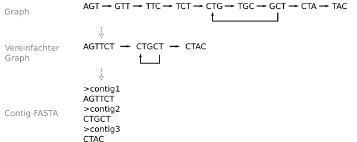

# De Novo Assembler - part 2

After you have created a DBG from input data, now you can use it to reconstruct the genome. The first step to this end it simplifying the graph by merging stretches of nodes with only one path leading through them. After this process, the graph is not a DBG anymore, since nodes can have sequences of differing lengths. Instead, now each node represents a sequence that is definitely present in the genome.

## Concept of merging nodes

Two nodes should only be merged if there are no paths through the graph including these two nodes. Accordingly, the criteria for merging two nodes are the following:

* If the node has more than one outgoing edge, it cannot be merged with any of the nodes it has outgoing edges to (because it would not be clear which of the nodes it has outgoing edges to it should be merged with)
* If a node A has an incoming edge from node B and B has more than one outgoing edge, the two nodes cannot be merged (this is the problem above, just from a different point of view - above, it was described from the point of view of node B)
* If a node has more than one incoming edge, it cannot be merged with any of the nodes it has incoming edges from (since it would ont be clear which one to merge it with)

After two nodes A -> B have been merged to a node C, it has to be ensured that the information in the graph is kept intact:
  * The incoming edges of A become the incoming edges of C
  * The outgoing edges of B become the outgoing edges of C
  * The sequence of C is the sequence of A plus the last base of the sequence of B

The nodes in the graph need to be merged until the graph has no two nodes left that can be merged. You can use a new graph for that: Take any random node from the unsimplified DBG, then merge it in both directions as long as possible (remember to remove the nodes you merge into that node out of the unsimplified DBG too), and once no more nodes can be merged to it, put it into the new graph (i.e. a new Set of nodes). If you keep doing that until there are no more nodes left in the unsimplified DBG, you will have ensured that the new graph contains all nodes from the unsimplified DBG, and that each node has been merged as far as possible.

After you have finished merging the nodes, you can simply output the sequences of all nodes as a FASTA file. Those are the contigs in your graph: The sequences of which you can be sure that they are present in the genome.

The following is a simple example of a linear graph merged into a single node and output as a single contig:


This is exactly what should happen with test.fasta with a k-mer length of 3.

This here is a slightly more complex example where not all nodes can be merged (the cycle in the graph makes it impossible):



After the graph simplification, in this case you get 3 nodes, with each of them representing a contig. The reason is that the graph does not allow an unambiguous reconstruction of the genome: You cannot tell for sure how often the node "CTGCT" occurs in the genome. Looking at the graph, the genome could be "AGTT**CTGCT**CTAC", but it could also be "AGTT **CTGCTG**_CTGCTGCTG_**CTGCTG**_CTGCTG_ CTAC".

Here, the importance of the k-mer length becomes clear: If you choose too low a k-mer length for the assembly, you cannot clearly resolve repetitive sequences (such as CTGCT above) and you will only be able to reconstruct short contigs instead of the whole genome. If the k-mer length is too long, then you will not find enough overlaps between reads and the DBG will just fall apart into several subgraphs that are not connected to each other, again leading to short contigs instead of a full genome.

## Implementation

For the genome reconstruction, extend the class ```DBGNode``` with the following methods:

* ```can_extend_next(self)```: Checks whether the node can be extended towards the outgoing edges and returns ```true``` or ```false```. 
* ```can_extend_prev(self)```: Checks whether the node can be extended towards the incoming edges and returns ```true``` or ```false```.
* ```extend_next(self)```: Extends the node (if possible) towards the outgoing edge. Remember to adjust the incoming/outgoing edges of the node and its sequence! This method should return the node that was "consumed" during the extension (te node that was added to this one), this will make it easier to remove nodes in `simplify` in `DBGraph` later on.
* ```extend_prev(self)```: Extends the node (if possible) towards the incoming edge. Remember to adjust the incoming/outgoing edges of the node and its sequence! This method should return the node that was "consumed" during the extension (te node that was added to this one), this will make it easier to remove nodes in `simplify` in `DBGraph` later on.

Then, implement the following additional methods in `DBGraph`:

* ```simplify(self)```: Simplifies the DBG. Attention: After simplifying the graph, adding new k-mers should not be possible anymore!
* ```get_FASTA(self)```: Returns the list of all sequences in the graph as a string in the FASTA format.

## Identifying sequences using BLAST

The genome sequence itself is hard to interpret on its own. The question now is: What does this sequence represent? In order to answer that question, one can compare the reconstructed sequence (or contig sequences) with a database of known sequences. One popular tool for doing this is BLAST (Basic Local Alignment Search Tool) in combination with the sequence databases hosted by the NCBI (National Centre for Biotechnology Information). You can find the tool online here:

https://blast.ncbi.nlm.nih.gov/Blast.cgi

If you click on "Nucleotide BLAST" (https://blast.ncbi.nlm.nih.gov/Blast.cgi?PROGRAM=blastn&PAGE_TYPE=BlastSearch&LINK_LOC=blasthome), you get to a page where you can enter a sequence under "Enter Query Sequence" (you can leave the other parameters at their default settings). Then you can start the search using the "BLAST" button:


You will be forwarded to a status page that shows the current state of the request. Once the search has been completed (usually within less than 30 seconds) you will be presented with a result page (in this example, the result of searching for "atctcgtcagtattgacaatactgtattatggagctaatggatccactgctgaacagcta" is shown):


Here, you can see a list of the sequences from the database that have a high level of similarity towards the sequence you entered. The most important parts are the query coverage (how many percent of the sequence you entered are also present in the database sequence) and the percent identity (how many percent of the bases that are present both in the sequence you entered and in the sequence in the database are identical to each other). Please note that a high query coverage and percent identity are not definitive evidence for the sequences coming from the same organism: Sequences can be present in different organisms, and due to the sheer size of the database short query sequences are likely to just randomly be present in the database. This last factor is shown by the E value: it shows how likely the algorithm thinks that the similarity between query and database sequences is simply due to the size of the database. A high number is bad, a low number is good - generally, numbers below 1E-10 are considered trustworthy.

A different view showing which organisms the similarities have been found in can be found under the "Taxonomy" tab:


This shows a taxonomic tree showing which nodes contain how many sequences similar to the query sequence. In this case, you can see that most of the hits are within "Orthopoxvirus" - all other hits are synthetic sequences (an "expression vector" is a synthetically generated sequence that is used for experiments). This becomes even clearer when you click on "Taxonomy" in the tabs underneath "Taxonomy":


In this case it is thus possible to say that with a very high likelihood, the sequence "atctcgtcagtattgacaatactgtattatggagctaatggatccactgctgaacagcta" comes from an Orthopoxvirus (which can be valuable information in a diagnostic context).

## Analysis task

Please use BLAST to find out what organism the genome you assemble from "virus_perfectreads.fasta" most likely comes from. 

Enter your reply in the file ```README.md``` (i.e. in this file in your repository):

```text
The sequences from virus_perfectreads.fasta most likely come from the virus: XXXX
```

Please also make a screenshot of your BLAST result that led you to the above conclusion and replace the file `BLAST-Ergebnis.png` in the folder `Bilder` in this repository with that screenshot. It should then appear here:


Finally, please enter the k-mer length you used for the assembly here:

```text
Used k-mer length: XXX
```

and paste the contents of the resulting FASTA file here:

```text
>1
AGT...
>2
....
```

**Attention**: Please use only one sequence for each BLAST request, e.g. the longest contig from your assembly! The admins at NCBI don't like it when people just upload huge files with lots of contigs or raw reads, since the service is used internationally and that requires fair use of the resources!